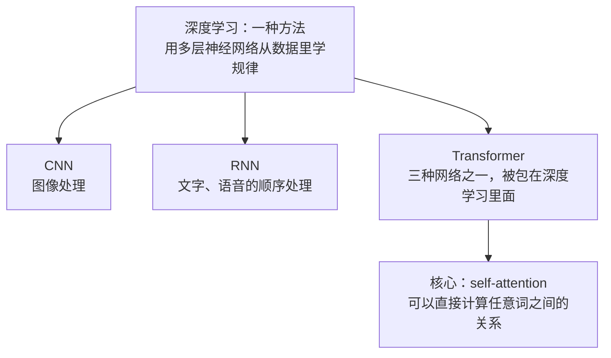
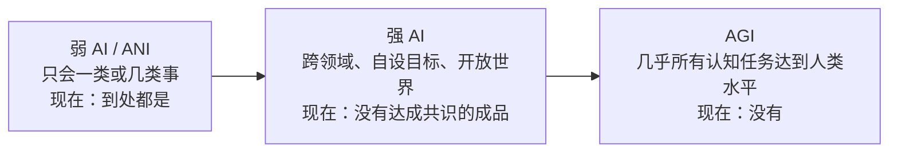
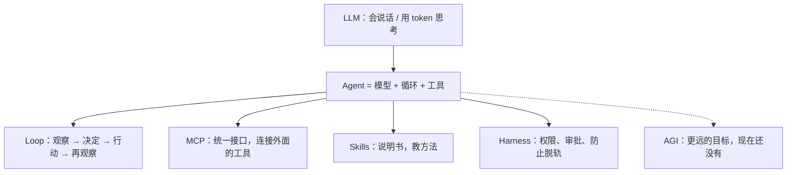
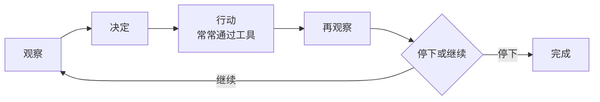
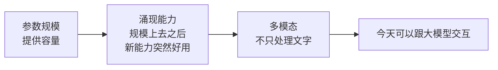
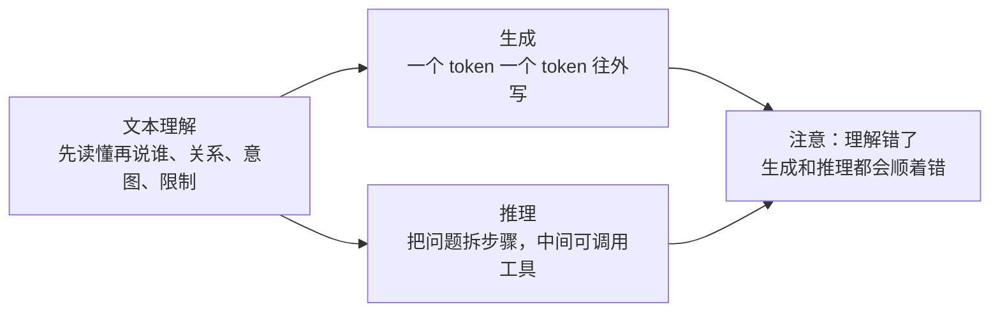

# 1.1 人工智能发展脉络与核心概念

---

## 一、这一章要解决什么

AI 常被讲成魔法。它不是。它是统计模型、数据、算力，再加上包在外面的工程。

读完这一章，应该能做到：

- 用自己的话解释 **LLM、AGI、agent、MCP、skills、loop、harness**
- 分清 **弱 AI / 强 AI / AGI**，并说清我们现在处在哪一阶段
- 说明大模型的实力从哪来：**参数规模、涌现能力、多模态**
- 说清能力基座：**文本理解、生成、推理**
- 对当前大模型行业有一张地图，但不把任何排行榜当成真理

---

## 二、重要节点

深度学习和Transformer是我认为对AI贡献比较大的，许多重大研究也是从这两个延伸出来的。

| 对比项 | 深度学习 | Transformer |
| --- | --- | --- |
| 它是什么 | 一种方法：用多层神经网络从数据里学规律 | 该方法里的一种网络架构，不是另一种方法 |
| 范围 | 包括 CNN、RNN、Transformer 三种常见网络 | 三种网络之一，被包在深度学习里面 |
| 怎么干活 | CNN 用于图像处理；RNN 用于文字、语音的顺序处理 | 核心是 self-attention，可以直接计算任意词之间的关系 |

---

## 三、弱 AI、强 AI、AGI —— 以及我们现在在哪

| 名称 | 含义 | 例子 | 现在有没有 |
| --- | --- | --- | --- |
| 弱 AI（专用 / ANI） | 只会一类或几类事 | AlphaGo：围棋超人，换去写邮件就不会；手机人脸解锁、安检闸机：只负责「是不是同一个人」；谷歌翻译、DeepL：只做语言转换；ChatGPT、Claude：话题很宽、也能写代码，本质仍是「处理语言」这一类事 | 到处都是 |
| 强 AI（常被当成「接近通用」） | 能跨领域迁移、自己设定目标、在开放世界里稳定行动 | 发布会上常说的「已经接近通用」「能当同事」；科幻里那种自己找目标、在开放世界里稳定行动的机器人。 | 没有达成共识的成品 |
| AGI | 几乎所有认知任务达到人类水平 | 真正的通用智能：换一份从没专门训练过的新工作也能稳定做好，物理、法律、社交上的认知任务达到或超过人类。目前没有实物，只存在于目标描述和科幻设定里 | 没有 |

**当前阶段（2026）：** 我们处在非常强的弱 AI阶段。语言、代码、图像上能覆盖很多任务，甚至可以改变我们的工作方式。但它们仍然是一个处理语言的专用系统。

<mark>我的理解：

现在的大模型都是对已知的数据进行学习，然后通过思考给我输出。但是还不能在一个从来没有见过的领域，稳定的学会；不能发现自己错了并停下来。</mark>

---

## 四、核心名词

产品文案里这些词经常搅在一起。把层级分开记。

### LLM

**Large Language Model，大语言模型。** 一个神经网络，现在几乎都是 Transformer，用海量文本训练，任务是预测下一个 token。

ChatGPT、Claude、Gemini、通义、Kimi，以及 Cursor 里的编程模型，底层都是 LLM（或基于 LLM 的系统），外面再包对话界面、工具和产品层。

### AGI

**Artificial General Intelligence，人工通用智能。** 这是一个目标，能在几乎所有人类认知任务上达到或超过人类水平的 AI。 不是「会聊天」，而是：换一个全新领域，不用专门再训练，也能稳定学会、稳定做好。

### Agent

**Agent 不是更聪明的模型。** 它是把模型放进一个循环里：

**观察 → 决定 → 行动（常常通过工具）→ 再观察 → 停下或继续。**

聊天机器人答一次就等你。Agent 可能读文件、跑命令、搜索、改代码、看结果、再试一次。智能仍然来自模型。

### Loop

Agent 真正干活的节奏：看现状 → 想下一步 → 调用工具 → 看结果 → 再想 → 再做 → ……直到完成

没有loop，模型只能一次性回答问题。但是有了loop，ai就可以给我们工作办事，不断的修正错误。

但是，上下文一长，步骤一多，就会思考混乱，步骤也会发生错误，后面会顺着错下去。

### MCP

**MCP就像一个统一的接口，AI通过这个接口来连接外面的工具，完成工作。**

没有MCP，每个工具都要有自己的一套连接规则。想要打开浏览器，要有一套浏览器的接口；想要打开日历，要有一套日历的接口........

### Skills

**Skill** 相当于AI的一个说明书，把步骤、规范、检查项都打包成一个文档，agent只需要读取这个skill就知道该怎么做。

Skill 存在的原因：把所有工具和所有规则一次性塞进第一条消息，模型会变差。更好的系统先给一份短目录，真正用到时再打开完整 skill。

### Harness

<mark>有了harness才能工作，体现在：我用codex和cursor工作的过程中，会停下来问我某个文件是否允许更改，让我审批这个行为它是否可以操作。</mark>

<mark>一句话：**模型用 token 思考；skills 教方法；MCP 接工具；loop 负责迭代；harness 防止整套东西脱轨。**</mark>

---

## 五、大模型的实力从哪来

三件事常被揉成一句。它们不是一回事。

### 参数规模

参数可以粗想成模型里要学的「旋钮」数量。旋钮越多，能拟合的模式越复杂。

- 早期语言模型：百万、千万级
- GPT-3：1750 亿
- 现在的前沿模型：往往更大——不是每次把所有旋钮都转一遍，而是每次只叫醒一部分专家

规模不是唯一原因，但是门槛：数据、算力、算法要一起涨。只堆参数、数据差、训练差，照样弱。

### 涌现能力

**涌现（emergence）** 指有些能力要等模型足够大（也训得足够好）才看得比较清楚。模型小的时候有些事情不会，如按指令做事、简单推理等。但当模型达到某个规模后，突然就会了，而且不是线性慢慢变好。

正确理解：能力曲线很陡，小模型上看不见，大模型上突然好用。

### 多模态

**多模态（multimodal）** 模型不只吃文本：还有图像、音频、视频，有时是文件和截图。

所以它能：看截图讲代码、听录音出纪要、根据照片写说明。

这仍然是「把别的信号编成数字，再做预测」，不是它真的像人一样看见了世界。

总结：参数规模提供容量，涌现让新能力在规模上去之后出现，多模态让它不只处理文字。三者叠在一起，我们才可以在今天跟大模型进行交互。

---

## 六、能力基座：理解、生成、推理

剥掉产品名。LLM 真正有用的工作，主要靠三条腿。

| 基座 | 它在做什么 | 你日常看到的 | 边界 |
| --- | --- | --- | --- |
| 文本理解 | 先读懂你在说谁、他们有什么关系、你想做什么、有哪些限制；再在这个理解上往下写。 | 读代码、总结会议、按文档答题 | 没给的上下文，它「理解」不了；只能猜 |
| 生成 | 按理解到的表示，一个 token 一个 token 往外写 | 写邮件、写代码、翻译、改语气 | 流畅 ≠ 正确；编造时也一样流畅 |
| 推理 | 在生成前/中把问题拆步骤，中间可调用工具 | 数学、排 bug、做计划、Agent 循环 | 是更强的「按步骤生成」，不是保证逻辑永真 |

注意：文本如果理解错了，后面的生成和推理都会顺着错。这也是为什么上下文不够时，它会开始猜。

---

## 七、行业地图（2026 年 9 月）

下面我分国际和中国的两个角度：

### 国际

| 公司 | 代表型号 | 常见印象 |
| --- | --- | --- |
| Anthropic | Claude Fable 5.1、Claude Opus 5 | 综合与编程经常最前；做事稳、适合长任务 |
| OpenAI | GPT-6 Astra、GPT-5.6 Sol | 产品生态最大；Agent、通用能力很强 |
| Google | Gemini 3.x（Flash / Pro） | 上下文大、速度快、性价比高，搜索和多模态深 |
| xAI | Grok 4.6 | 有竞争力，通常略低于前三，价格更冲 |

### 中国常见玩家

| 公司 / 产品 | 代表 | 常见印象 |
| --- | --- | --- |
| 月之暗面 | Kimi K3 | 长文本、国内综合靠前 |
| 阿里 | 通义 / Qwen3.8 Max | 开源权重里经常最强之一，企业落地多 |
| 智谱 | GLM-5.x | 国内综合与 Agent 常用 |
| DeepSeek | V4 系列 | 推理、性价比，开源影响力大 |
| 字节 | 豆包 | 入口大、C 端用户多 |
| 百度 | 文心 | 搜索和政务/企业渠道 |
