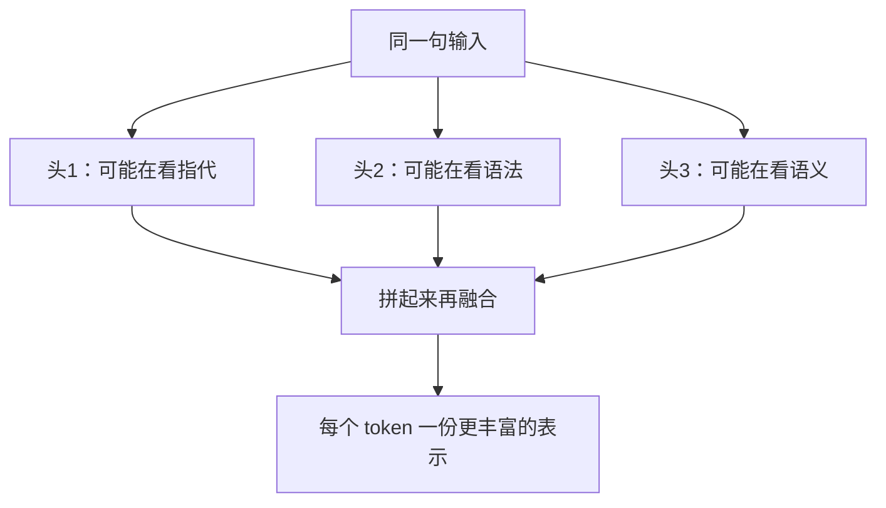

# 1.2  Understanding Transformer from Scratch

---

一、LLM的本质

本质：算概率来预测，而不是思考。

现有大语言模型的框架主要是Transformer，经过海量的文本训练，根据前面的词来预测下一个最可能出现的词。

###举例

例如上文是「今天天气真」，中文里后面接「好」的次数远多于接「桌子」。模型学到的就是这种统计规律。规模够大之后，规律细到能写代码、答题、聊天，看起来像思考。

底层仍是：

给定已经出现的内容，下一个 token 的概率分布是什么？然后按这个分布抽样。

###注意

token预测是一个概率事件，就算每一步都抽了当时概率最高的那个 token，整段仍可能是假的。模型是没有判断真假的能力的，token的输出只有「像不像训练数据里的说法」。比如，例如你问一个不存在的会议：

> 2024 年上海联泰第三季度战略会的结论是什么？

模型可能流畅写出「会议强调降本增效、明确了三条产品线……」。每句话单独看都像真的纪要，因为训练里这类公文非常多。概率一路都很高，但会根本没开过——这就是编造。

###RNN

RNN破不了局的原因：  
当RNN看到一句话时，只能把文字从左到右一个一个地串起来，并记住。它会像人脑一样，看多了，记忆会变得模糊。

###Transformer

Transformer：  
利用核心的部件self-attention来找不同词之间的关系，不用一个一个地排队，让每个词直接问所有词「谁跟我有关」，这就是注意力。


**Transformer model**

二、Token 与词嵌入：文字怎么变成数字

###Token 

Token：切成模型认识的碎片。

英文不一定按单词切，中文更不是按字切。分词器（tokenizer）把文本切成 token：

例子：

- `"ChatGPT"` 可能是一个 token，也可能是 `Chat` + `GPT`
- `"注意力机制"` 可能被切成 `注意` / `力` / `机制`，取决于词表

模型的词表通常有几万到十几万个 token。每个 token 有一个编号，比如 `她 → 8821`。模型真正预测的，是下一个编号，不是「下一个汉字」。

###词嵌入

我的理解：

每个token的编号在词表里对应一整行数字，查出这一行才叫做嵌入。

注意：不同的编号不是随意串联起来的。 训练会把经常一起出现、意思相近的词，推到比较像的数字串上，所以「苹果」和「香蕉」会比较近，「苹果」和「合同」会比较远。

文字变成了可以加减、比远近的数字。 后面所有计算都在这串数字上发生。

一句话总结：词嵌入 = 每个 token 对应的、有远近关系的一串数字。

三、注意力 QKV

###注意力分数怎么算

举例子：

> 小明把苹果给了小红，因为她饿了。

注意力要解决的事：处理「她」的时候，要能一下子看到「小红」，而不是指望小笔记本还记得。

处理「她」时，模型在问：**这句话里，谁最可能是「她」？**

### **Q、K、V 各是什么（三个向量）**

每个 token 会从自己的嵌入里，用三组不同的权重，变出三个向量：


| **符号** | **名字**   | **白话**                          |
| ------ | -------- | ------------------------------- |
| **Q**  | Query，查询 | 「我在找什么？」——「她」在找：女性、人名、可能的先行词    |
| **K**  | Key，键    | 「我是什么、别人怎么检索我？」——「小红」亮出：我是人名、女性 |
| **V**  | Value，值  | 「匹配上之后，我真正给你的信息」——小红的语义内容       |


像搜资料：

- Q 是你在搜索框里打的问题
- K 是每篇文章的标题 / 标签
- V 是文章正文

标题对上了，你拿走的是正文，不是标题本身。

总公式：


1、点积得分数

分数 = Q · K       「她」和「小红」的分数会比较高，和「苹果」会比较低。

理解：两个向量同向，点积越大，分数越高，表明Q和K的关系更相近。

2、缩放

除以 \sqrt{d_k}（d_k 是 K 的维度）。

###为什么要缩放？

如果分数很大，做了softmax之后会把这个分数的权重直接拉到了1，其他权重几乎为0，等于「她」只认一个人，别人看都不看。

一句话总结：缩放不是改谁更相关，只是防止分数爆炸，让后面还能比较着学。

3、Softmax

本质：把“谁更像”变成“分多少注意力”

缩放之后仍是一串可正可负的分数，比如：


| **词** | **分数** |
| ----- | ------ |
| 小红    | 2.8    |
| 小明    | 1.1    |
| 苹果    | -0.4   |


这串数还不能直接当权重：有负数，加起来也不等于 1，没法说「70% 的注意力给小红」。

Softmax 做两件事：

（1）把每个分数变成正数（越大的仍越大，负数会变成很小的正数）

（2）再除以它们的总和，让所有权重加起来刚好是 1

于是变成类似：


| **词**  | **注意力权重** |
| ------ | --------- |
| 小红     | 0.71      |
| 小明     | 0.18      |
| 苹果     | 0.02      |
| ……     | ……        |
| **合计** | **1.00**  |


这就是「注意力」三个字的字面意思：100% 的注意力怎么分。后面用这些比例去混合每个人的 V——小红占七成，小明占两成，苹果几乎可以忽略。

一句话：**Softmax 把「像不像的分数」换成「分给每个人多少注意力」，而且必须分完、不许超支。**

4、V 不是「又一种打分」，而是 被选中后实际注入的信息。没有 V，注意力只会知道「该看谁」，却没有任何东西可写进「她」。

四、多头注意力：为什么要好几组 QKV

一组 QKV 像一双眼睛，往往只能稳定盯住一种关系。但是，句子里同时有很多种关系。

多头（multi-head）就是并排好几双眼睛。 每一头有自己的 Q、K、V 权重，看的角度不同。




每一个头都负责一定的任务，训练自己会分工。单头容易只看见一种匹配，多头是并行看多种关系。

五、前馈网络：混完信息，各自消化

类比开会：

- 注意力 = 大家互相提问、听别人补充
- FFN = 散会后每个人回工位，消化刚才听到的，写成自己的笔记

注意力部分结束之后，每个位置还要自己想一遍。

所以一层 Transformer 块几乎总是：

```
输入
  → 多头注意力（互相看）
  → 残差连接 + 归一化
  → 前馈网络（各自消化）
  → 残差连接 + 归一化
  → 输出，交给下一层
```

###残差：

用改稿来想：

- 不对的理解：把第 1 稿、第 2 稿、第 3 稿整叠纸都钉在一起
- 残差真正做的：在第 3 稿边上写「改动」，再把第 3 稿原文加回去，得到第 4 稿

所以每一层都还留着「进来时的样子」，改动只是叠在上面。这样叠几十上百层时，最早的信号还能顺着这些「旁路」往前走，不容易被改没。

一层层接下去，效果上后面会带着前面的痕迹（因为每一跳都把上一跳的结果加进来了），但计算上永远是：

> 只加自己的输入，不是把历史全部重新加一遍。

六、位置编码：模型怎么知道谁前谁后

核心就一件事：注意力本身看不见顺序。绝对位置编码和 RoPE，是两种把一个句子中排列词的先后顺序的办法。

注意力算的是：这个词的 Q，和那个词的 K，有多像。它不管谁在前、谁在后、中间隔了几个词。

所以如果只给它三个词「狗、咬、人」，下面两句对它几乎是同一袋词：

- 狗咬人
- 人咬狗

意思完全相反，但匹配分数可以一样。必须另外告诉它：谁是第几个，或者两人隔多远。


|         | **绝对位置编号**              | **RoPE（旋转位置编号）**   |
| ------- | ----------------------- | ------------------ |
| 做法      | 每人胸牌写「我是 1 号、2 号……」     | 每人按座位把身体转一个角       |
| 模型看到的   | 你是几号、他是几号               | 我们面对面差了多少度（隔几座）    |
| 对语言更自然的 | 较弱：语法很少问「你是全文第 1847 个词」 | 较强：常问「你在我前面第 3 个吗」 |
| 句子变长    | 新座位号训练时可能没见过            | 还是同一套「差几步就差几度」     |


七、Tensor Core：4×4 涂色图在干什么

注意力里全是乘加（点积、再混 V）。真模型里表很大，一个格子一个格子用 Python 算会极慢，所以放到 GPU 上算。

GPU 里有一种专用零件叫 **Tensor Core**。它不爱「两个数、两个数」地乘，而爱一次吃进两块很小的表：

 D = A *B + C 

第一代的规格里，A、B、C、D 都是 **4×4**。课纲说的「4×4 涂色图」，画的就是这一块。

###我的理解

注意力有许多乘加运算，现实中数据量很大。为了加快速度，用 GPU 来算。大表会被切成许多 4×4 的小块，Tensor Core 一次算完一块。

注意：

- 切成 4×4 的主要是软件（PyTorch 后面的矩阵库），不是 Tensor Core 自己去撕表。
- Tensor Core 加速的是矩阵乘这一类。
- 4×4 是最早、最好画的一格。新一代 GPU 一块可以更大。

